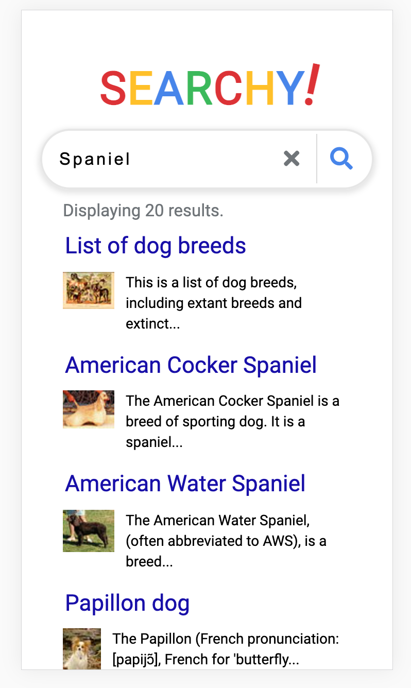

### Search Engine Clone ###

Clone app using wikipedia API for a basic search engine

The purpose of the prpject was to leearn about accesibility thorugh HTML and the use of SASS

Vanilla JS used not a framwork and the funcionality is working perfectly

Big shout to Traversy Media for the guides 

